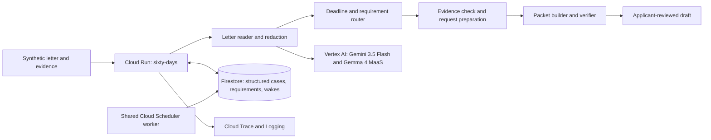

# Sixty Days

**An applicant-controlled deadline and evidence workflow for disaster-assistance appeals.**

Sixty Days reads a synthetic determination letter, preserves its exact stated reason, derives the
deadline, routes supporting-document requirements, checks observable evidence-photo framing,
prepares applicant-reviewable request drafts, and builds a partial-safe draft packet. It does
**not** provide legal advice, contact a third party, predict eligibility, or submit an appeal.

- [Live application](https://sixty-days-109051079423.us-central1.run.app)
- [Judge evidence](https://sixty-days-109051079423.us-central1.run.app/judges)
- [Machine-checkable conformance](https://sixty-days-109051079423.us-central1.run.app/sixty-days/conformance)

## Verified evidence

| Gate | Result |
|---|---:|
| Public acceptance flow | **23/23** |
| Standalone tests | **187 passed** |
| Recorded letter fields | **20/20** |
| Recorded evidence decisions | **6/6** |
| Shared substrate exit test | **10/10** |
| Accessibility gate | **Pass, light and dark themes** |

Every synthetic input has adjacent truth. Recorded Gemini outputs and grading reports are committed
so extraction and evidence claims can be audited without trusting a screenshot.

## The problem

A disaster-assistance decision letter can start a short appeal window while requesting records held
by different people or organizations. Sixty Days keeps the exact decision reason, missing evidence,
deadline, and applicant-controlled next action visible in one connected workflow. It is an organizer
and deadline keeper, not a legal representative.

## What it does

1. **Understand:** transcribe the synthetic letter, redact direct identifiers, quote the stated
   decision reason, and calculate the deadline deterministically.
2. **Gather:** route ownership, occupancy, insurance, or damage evidence and check only observable
   photo framing and legibility.
3. **Track:** prepare a request for the applicant to review and send, then register a no-reply wake.
4. **Review:** assemble a draft PDF that preserves the reason and explicitly lists every missing
   item. The packet is marked not submitted.

## Architecture



The domain modules and copied spine execute in one `sixty-days` Cloud Run service. The
`spine-scan-due` scheduler job invokes a shared worker that claims due wakes from the same Firestore
substrate; it is not represented as a second Sixty Days service. Raw letter text, image bytes, and
applicant narrative are deliberately excluded from Firestore. The demo persists only explicit
`DEMO-*` application and `DR-DEMO*` disaster references; the API rejects real-looking identifiers.

The source version of the diagram is in [`docs/architecture.mmd`](docs/architecture.mmd).

## Reproduce locally

Prerequisites: Python 3.12 and, for live model calls, Application Default Credentials for a Google
Cloud project with Vertex AI enabled.

```bash
cd app
python -m venv .venv
.venv/bin/pip install -e ".[dev]"
python -m pytest -q
python scripts/check_a11y.py
```

Run deterministically with committed recordings:

```bash
export GOOGLE_CLOUD_PROJECT=agentic-fleet-2026
export SIM_MODE=true
export REPLAY_MODE=true
uvicorn service.main:app --reload
python scripts/sixty_days_demo_flow.py --url http://127.0.0.1:8000
curl -X POST -H "Content-Type: application/json" -d '{}' http://127.0.0.1:8000/exit-test
```

Deploying from `app/` with `bash deploy.sh` targets the independent Cloud Run service `sixty-days`.

## Safety and legal boundaries

- Synthetic, unbranded fixtures only; no real survivor or applicant data.
- No legal advice, eligibility prediction, appeal strategy, or outcome forecast.
- No send or submission endpoint; the applicant controls every external action.
- Evidence checks are limited to observable framing and legibility, never damage valuation.
- Partial packets remain visibly partial; missing evidence is never converted into a confident claim.
- The appeal letter or form is presented as optional in line with current FEMA guidance.

## Research basis

The workflow is grounded in the current
[FEMA Individual Assistance appeals quick reference](https://www.fema.gov/sites/default/files/documents/fema_ia-quick-reference_appeals.pdf),
[FEMA's decision-letter appeal tips](https://www.fema.gov/fact-sheet/8-tips-appealing-femas-decision-1),
and [GAO-20-503](https://www.gao.gov/products/gao-20-503). Public copy distinguishes official
requirements from product choices and avoids presenting the draft packet as an official form.

The requirement catalogue was tightened against three additional official sources:

- FEMA's [ownership and occupancy fact sheet](https://www.fema.gov/fact-sheet/verifying-home-ownership-or-occupancy)
  supports multiple alternative records and the date context now shown in the planner.
- FEMA's [insurance quick reference](https://www.fema.gov/sites/default/files/documents/fema_insurance_qrg_20241010.pdf)
  distinguishes settlements, denials, and policy evidence of exclusions or absent coverage. The
  product no longer treats an unsupported signed statement as equivalent insurer documentation.
- FEMA's [September 2025 IHP explainer](https://www.fema.gov/fact-sheet/fema-individuals-and-households-program-application-eligibility-registration-and-appeals)
  tells applicants to place application and disaster references on each submitted page. The draft
  PDF now repeats synthetic versions in every footer for applicant verification.

Photos remain optional supporting context in this product. They are never described as sufficient
proof, authenticated evidence, or a predictor of FEMA acceptance.

## Repository map

- `app/sixty_days/`: project domain logic
- `app/spine/`: copied, reviewed runtime substrate required by this standalone project
- `app/service/`: public and operational routes
- `app/fixtures/`: synthetic inputs, adjacent truth, and recorded model outputs
- `app/tests/`: unit, integration, safety, claims, and UI contract tests
- `app/scripts/`: fixture creation, recording, grading, accessibility, and demo verification
- `docs/research-traceability.md`: official source-to-guardrail decisions and rejected claims
- `SUBMISSION_KIT.md`: evidence-backed video and Devpost plan

## Disclosure

Built during the contest period with AI coding assistants. All public demonstration data is
synthetic. No government agency endorses this project, and the generated packet has no official
status.
