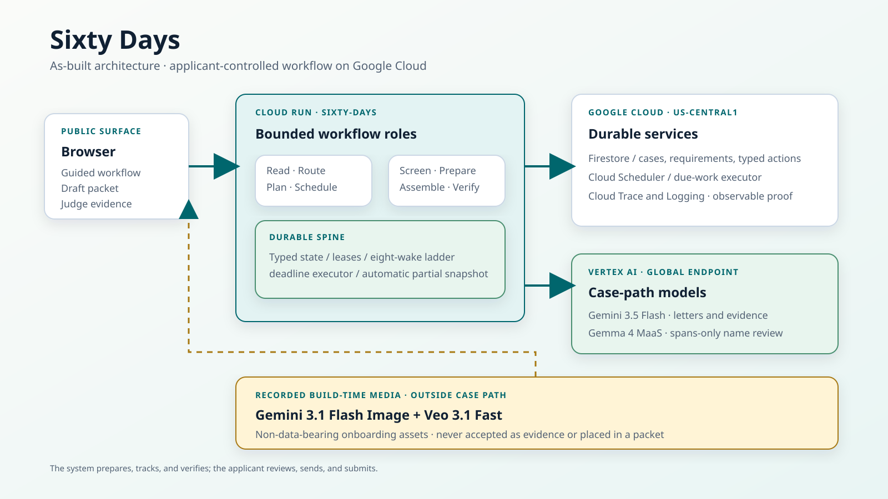

# Sixty Days: keep the deadline, evidence, and applicant together

**An applicant-controlled deadline and evidence workflow for disaster-assistance appeals.**

Sixty Days reads a synthetic determination letter, preserves its exact stated reason, calculates the
deadline, organizes supporting evidence, and builds a visibly incomplete draft packet when anything
is still missing. The agent carries the checklist and the clock; the applicant keeps every external
decision.

> **New here?** Open the live app, keep the default synthetic letter selected, and press
> **Start guided demo with this letter**. Nothing is sent and no real survivor data is used.

- [Open the live application](https://sixty-days-109051079423.us-central1.run.app)
- [Read the judge evidence](https://sixty-days-109051079423.us-central1.run.app/judges)
- [Inspect machine-checkable conformance](https://sixty-days-109051079423.us-central1.run.app/sixty-days/conformance)
- [Create your own API key](https://sixty-days-109051079423.us-central1.run.app/developer) — no account, no approval, no contact with me

## Judge it in 90 seconds

1. Press **Start guided demo with this letter**: the demo clock anchors to the synthetic letter date.
2. Inspect the exact quoted decision reason, routed evidence needs, deadline, and eight registered wakes.
3. Press **Screen close photo (expected retake)**: the observable framing check asks for a retake and selects the wider comparison.
4. Screen the wider photo: it may become ready for your review, never "accepted by FEMA."
5. Press **Prepare and track** using the clearly labelled do-not-send control, then inspect the draft with blanks and the no-reply wake.
6. Add an applicant explanation, press **Check draft packet**, and download the clearly marked draft PDF.
7. Advance the simulated days: watch the scheduled safeguard build a partial packet snapshot automatically while preserving every missing item.

Everything needed for the walkthrough is preset on the frontend. Disabled controls unlock only when
their prerequisites exist, so the judge can follow the numbered stages without guessing.

## Verified evidence

| Gate | Reproducible result |
|---|---:|
| Deployed public acceptance flow | **24/24** |
| Standalone automated tests | **365 passed** |
| Recorded letter fields | **20/20** |
| Recorded evidence decisions | **6/6** |
| Shared-substrate exit test | **10/10** |
| Accessibility gate | **Pass: light and dark themes** |

Every synthetic input has adjacent truth. Recorded Gemini outputs and grading reports are committed,
so the extraction and image-screening claims can be audited without trusting a screenshot.

## Why this friction

I have not lived this one, which is exactly why every claim behind it is named in
[docs/research-traceability.md](docs/research-traceability.md) rather than asserted.

The finding that survives audit is narrow and old enough to date precisely. Between 2016 and 2018,
roughly 1.7 million disaster-assistance applicants were determined ineligible, and among the
reasons GAO recorded were insufficient damage and missing supporting evidence
([GAO-20-503](https://www.gao.gov/products/gao-20-503)). That is historical context, not a current
denial rate and not an appeal-success estimate, and the ledger says so beside it. Current FEMA
guidance is what sets the shape of the work: a 60-day window, and an appeal expected to carry
case-specific records
([appeals quick reference](https://www.fema.gov/sites/default/files/documents/fema_ia-quick-reference_appeals.pdf)).
So the failure being addressed here is documentary and the clock is fixed — which is what makes it
a job for a deadline keeper rather than an assistant.

I could not get a caseworker or a survivor to review this, and
[VALIDATION_EVIDENCE.md](VALIDATION_EVIDENCE.md) says so rather than implying otherwise. What is
available is what practitioners have already written down for each other. The Texas Law Help
disaster manual — "this resource is meant for volunteer lawyers" — puts the burden exactly where
this product assumes it falls: the applicant collects the evidence, not FEMA, and "without a repair
estimate, FEMA will likely deny the applicant immediately." The Advocates for Disaster Justice
appeals FAQ, published with Lone Star Legal Aid, NLADA and the ABA's pro bono committee, lists the
records an appeal carries and requires third-party documents to name the third party, which is why
every route here names a holder rather than just a document.

**One of those sources corrected the product.** The same manual notes that FEMA "generally accepts
appeals submitted after the deadline for a good cause reason." The closing message used to tell an
applicant at day 61 only that the window had closed — true, and read at the wrong moment it means
"you have lost." It now says a late appeal can still be accepted for good cause and that a disaster
legal-aid service is worth asking first.

**What is not in this project is the statistic that made it feel urgent.** A 5% appeal-rate figure
was the number the idea started from, and it did not survive source review. It is recorded under
*claims deliberately rejected* rather than quietly dropped.

Two product decisions went the same way, and these changed code, not just wording:

- The insurer route used to accept a self-authored statement as evidence of absent coverage. FEMA's
  insurance guide names settlement, denial, and policy documents instead, so the unsupported
  equivalence was removed.
- "A wide photo proves the damage" became "a wide photo is optional context," because the official
  examples emphasise case-specific records. Photo screening now reports only observable framing and
  legibility, and no result is called authentic, sufficient, causal, valued, or agency-approved.

That is the friction brought to this hackathon: not a story about me, but a process I could check,
where the sources were allowed to overrule the product three times. The same discipline is why the
letter always outranks the generic catalogue, why every reason is a verified quote, and why there
is no endpoint that files anything.

## The problem

A disaster-assistance decision letter can start a short appeal window while the relevant records sit
with different people or organizations. The applicant may need to understand the exact reason, gather
case-specific documents, follow up on missing replies, and keep the deadline visible, all while
recovering from the disaster itself.

Sixty Days joins those tasks into one calm workflow. It is an organizer and deadline keeper, not a
lawyer, caseworker, insurer, or filing service.

## What happens end to end

| Stage | What the system does | What remains applicant-controlled |
|---|---|---|
| **1. Understand** | Transcribes a synthetic letter, removes direct identifiers, verifies an exact reason quote, and derives the stated deadline deterministically. | The decision letter outranks the generic catalogue. An unsafe mismatch stops for review. |
| **2. Gather** | Routes ownership, occupancy, insurance, or damage evidence and checks only observable photo framing and legibility. | No photo is called authentic, sufficient, causal, valued, or agency-approved. |
| **3. Track** | Prepares a records-request draft and registers a no-reply wake. | The applicant reviews and sends it; the service has no contact or send route. |
| **4. Review** | Builds a partial-safe draft packet, repeats synthetic references in each footer, and lists every missing item. | The applicant verifies the draft and decides what, if anything, to submit. |
| **5. Wake** | Registers all eight reminders up front, from day 3 up to the deadline the letter states. Due wakes create typed case actions; the packet safeguard builds a partial snapshot from accepted evidence automatically. | No wake contacts a third party, submits a packet, or claims an official filing or extension. |
| **6. Verify** | Rejects unsupported quotes, real-looking identifiers, and overconfident evidence claims. | It does not interpret law, predict eligibility, or forecast appeal success. |

## Architecture



The solid path below is the live applicant workflow. The dotted path is optional onboarding media
generated at build time. It never sees a letter, image, case reference, or applicant narrative.


The domain modules and copied spine run inside one `sixty-days` Cloud Run service. It is not a fleet of
pretend microservices. A dedicated `sixty-days-wake-scan` Cloud Scheduler job posts to
`/internal/scan-due` every minute, authenticated with an OIDC token minted for
`agent-wake-scheduler` and scoped to this service's URL as the audience. The worker claims only the
wakes this service owns, and it reads them from a collection no other service scans. Claiming is a
compare-and-swap, so a worker that claimed a wake it cannot execute would complete it and silently
retire another service's safeguard. An ownership predicate stops this service doing that to a
neighbour; the separate collection is what stops a neighbour doing it here, and it does not depend
on anyone else's deployment. Each claimed wake creates one idempotent, typed case
action. The packet safeguard actually builds and records a partial packet snapshot; no action sends
or submits. Raw letter text,
image bytes, and applicant narrative are deliberately omitted from durable case records.

Only explicit `DEMO-*` application references and `DR-DEMO*` disaster references are accepted by
the public packet workflow. Simulation clocks are namespaced per public evaluation, and simulated
wake claims are filtered by the owning project.

- [Diffable Mermaid source](docs/architecture.mmd)
- [Recorded media provenance: prompts, model IDs, sizes, and SHA-256 hashes](app/web/media/bonus-media-provenance.json)
- [Bonus evidence map](BONUS_EVIDENCE.md)

## Why each model is here

| Model | Narrow job | Boundary |
|---|---|---|
| **Gemini 3.5 Flash** | Structured transcription of synthetic letters and observable evidence-photo screening. | Outputs are schema-validated and graded against adjacent truth. |
| **Gemma 4 MaaS** (`gemma-4-26b-a4b-it-maas`) | Second-pass privacy review after deterministic redaction. | It does not interpret eligibility or legal rights. |
| **Gemini 3.1 Flash Image** | Creates the optional abstract first-use briefing. | Build-time media only; no applicant data or case facts. |
| **Veo 3.1 Fast** | Creates the optional four-second motion briefing. | Muted, user-controlled, and outside the case path. |

**Model Armor** screens de-identified `/v1` text for prompt injection and jailbreak attempts before
any model call, in front of the deterministic redaction and quarantine rather than instead of them.
It can only ever make the pipeline stricter: a match blocks, and an outage is recorded as
*unavailable* rather than treated as a pass. Measured live, it blocked a bare injection and missed
the same injection diluted inside a long letter, which the deterministic quarantine caught. Both
results are published in [the validation evidence](VALIDATION_EVIDENCE.md).

**A live model call you can trigger.** The console replays recordings so judging is repeatable, so
the console also carries one button that calls Gemini 3.5 Flash on Vertex AI for real, on a
synthetic letter image with no transcript supplied, and grades the answer against the same truth
file by the same fields as the published run. Bounded by a durable per-visitor and global daily
cap.

The additional models have narrow, inspectable roles. Their prompts, exact IDs, byte counts, and
hashes are public, and none of them creates evidence or makes an appeal decision.

## Safety and legal boundaries

- Synthetic, unbranded fixtures only; no real survivor or applicant data.
- Deterministic redaction covers names with common punctuation, lowercase labels, street addresses, PO boxes, and FEMA-style case references before model review.
- Every source reference must contain a nonempty quote; one valid reference cannot launder an empty one.
- No legal advice, eligibility prediction, appeal strategy, or outcome forecast.
- No send, contact, or submission endpoint; the applicant controls every external action.
- Evidence screening is limited to observable framing and legibility, never authenticity or damage valuation.
- A "ready for your review" result is not a claim that an agency will accept the evidence.
- Partial packets remain visibly partial; missing evidence is never converted into confidence.
- The appeal letter or form remains optional, in line with the reviewed FEMA guidance.
- Raw letters, photos, transcriptions, and applicant free text are omitted from Firestore.

## Research and citations

Official guidance changed the product. The decision letter now outranks the generic requirement
catalogue; insurer-document requests no longer treat a self-authored statement as equivalent; and
every PDF page repeats synthetic references for applicant verification. Historical GAO data explains
the problem context. It is never presented as a current denial rate.

### Complete source list

1. [FEMA: Individual Assistance Appeals Quick Reference](https://www.fema.gov/sites/default/files/documents/fema_ia-quick-reference_appeals.pdf) describes the 60-day appeal window, supporting-document examples, and an optional appeal form or letter; Sixty Days neither files nor calls its PDF official.
2. [FEMA: 8 Tips for Appealing FEMA's Decision](https://www.fema.gov/fact-sheet/8-tips-appealing-femas-decision-1) says the decision letter explains the reason and relevant documents; every routed requirement therefore begins with an exact verified quote.
3. [FEMA: Verifying Home Ownership or Occupancy](https://www.fema.gov/fact-sheet/verifying-home-ownership-or-occupancy) lists multiple records and date contexts; the planner offers examples without calling any one document sufficient.
4. [FEMA: Help for Survivors with Insurance](https://www.fema.gov/sites/default/files/documents/fema_insurance_qrg_20241010.pdf) distinguishes settlement information, denials, and policy evidence of exclusions or absent coverage; the applicant, not the service, contacts the insurer.
5. [FEMA: IHP Application, Eligibility, Registration and Appeals](https://www.fema.gov/fact-sheet/fema-individuals-and-households-program-application-eligibility-registration-and-appeals) instructs applicants to put application and disaster references on submitted pages; the draft repeats validated synthetic references and asks the applicant to verify them.
6. [GAO-20-503: Disaster Assistance](https://www.gao.gov/products/gao-20-503) reports historical 2016 to 2018 ineligibility context and cited reasons such as insufficient damage and missing support; this is not a current rate or an appeal-success estimate.

For the official-source hierarchy, exact source-to-guardrail mapping, and rejected claims, read the
[research traceability ledger](docs/research-traceability.md).

## Use it through the API

The public web console remains a synthetic, credential-free judge experience. The protected `/v1`
surface accepts de-identified determination-letter text for applicant-controlled preparation.
Every key derives a private tenant on the server. A caller cannot select another tenant in JSON.

The raw letter and model response are processed in memory and not persisted. Stored case state is
limited to pseudonymous references, verified reason quotes, deadlines, requirements, wake records,
and draft status. The API can prepare a third-party request and a packet draft, but it has no send,
contact, filing, submission, legal-advice, or outcome-prediction operation.

Full provisioning, expiry, and rotation instructions are in [the beta API guide](docs/api-beta.md).

Anyone evaluating this project can open [the live Developer page](https://sixty-days-109051079423.us-central1.run.app/developer),
name a workspace, and generate a tenant-scoped key that expires after seven days. There is no
invitation code, no account, and no approval step, because a private code cannot gate a beta whose
whole purpose is to be tested by people with no way to contact the author. What replaces the code is
a durable ceiling on issuance itself: up to 50 keys per address per day behind a global daily cap.
The plaintext key is shown once and remains only in page memory. The page includes a connection
test, a copyable project request, immediate revocation, and a link to the interactive OpenAPI schema.

Operators can also create a non-expiring key through Secret Manager:

```bash
cd app
python scripts/create_beta_key.py --tenant aid_group_one --label "Aid group one"
```

Store the printed hash-only JSON as the `BETA_API_KEY_HASHES` Secret Manager value and expose it
to Cloud Run. Give the plaintext key only to the intended API user.

```bash
curl -H "X-API-Key: $SIXTY_DAYS_API_KEY" \
  https://sixty-days-109051079423.us-central1.run.app/v1

curl -X POST \
  -H "X-API-Key: $SIXTY_DAYS_API_KEY" \
  -H "Content-Type: application/json" \
  -d '{"document":"DE-IDENTIFIED DETERMINATION LETTER ...","applicant_ref":"SUBJECT-001","disaster_ref":"DR-TEST-001","acknowledge_deidentified":true}' \
  https://sixty-days-109051079423.us-central1.run.app/v1/cases
```

Open `/docs`, select **Authorize**, and enter the key for interactive schemas. The API rejects
obvious direct identifiers before model processing, but an API key does not make arbitrary personal
documents safe. This beta is for synthetic or deliberately de-identified text only.

## Reproduce locally

Prerequisites: Python 3.12. New live model calls also require Application Default Credentials
for a Google Cloud project with Vertex AI enabled.

```bash
cd app
python -m venv .venv
source .venv/bin/activate        # Windows: .venv\Scripts\activate
pip install -e ".[dev]"
python -m pytest -q              # 365 passed
python scripts/check_a11y.py     # light and dark themes
```

Run deterministically with the committed recordings:

```bash
export GOOGLE_CLOUD_PROJECT=agentic-fleet-2026     # Windows: set GOOGLE_CLOUD_PROJECT=...
export SIM_MODE=true
export REPLAY_MODE=true
uvicorn service.main:app --reload                  # leave running, then in a second shell:
python scripts/sixty_days_demo_flow.py --url http://127.0.0.1:8000   # 24/24
curl -X POST -H "Content-Type: application/json" -d '{}' http://127.0.0.1:8000/exit-test   # 10/10
```

The guided control calls `/sixty-days/demo/anchor` before opening the selected fixture. It freezes
the labelled simulation at that letter's date without deleting case, wake, or audit records, so the
eight-reminder sequence stays reproducible during judging. The close-photo preset automatically
selects the wider comparison after the expected retake.

Deploying from `app/` with `bash deploy.sh` targets the independent Cloud Run service
`sixty-days`. The explicit empty JSON body in the exit-test request matters; a bodyless POST
receives HTTP 411.

## Repository map

- `app/sixty_days/`: project domain logic
- `app/spine/`: copied, reviewed runtime substrate required by this standalone project
- `app/service/`: public and operational routes
- `app/fixtures/`: synthetic inputs, adjacent truth, and recorded model outputs
- `app/tests/`: unit, integration, safety, claim, and UI-contract tests
- `app/scripts/`: fixture creation, recording, grading, accessibility, demo, and deployment verification
- `docs/research-traceability.md`: official source-to-guardrail decisions and rejected claims
- [Validation evidence](VALIDATION_EVIDENCE.md): research-to-test evidence, adversarial checks, and explicit limits
- [Project differentiation](PROJECT_DIFFERENTIATION.md): concrete separation from the other submission and shared-spine disclosure
- `LICENSE`: MIT
- `SUBMISSION_LINKS.md`: every public URL, fetched by the compliance script rather than trusted
- [Live scheduler proof](https://sixty-days-109051079423.us-central1.run.app/sixty-days/scheduler): wall-clock evidence that the deadline keeper is being woken, refreshed in the console

## Disclosure

Built during the contest period with AI coding assistants. All public demonstration data is
synthetic. No government agency endorses this project, and the generated packet has no official
status.
